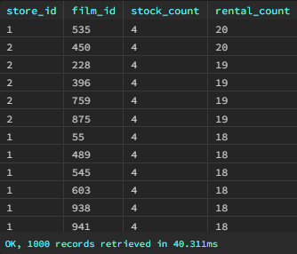
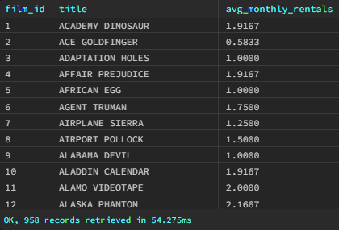
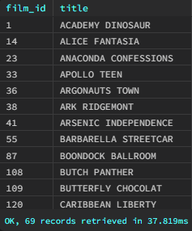
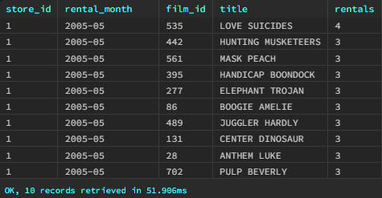
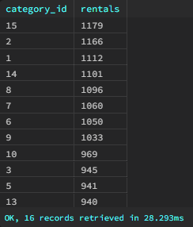
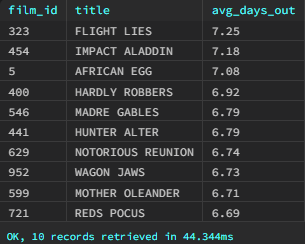
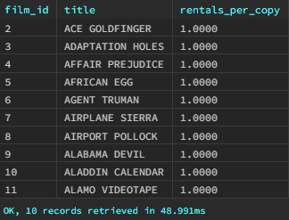
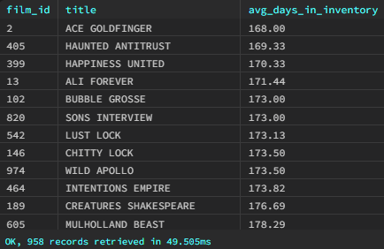
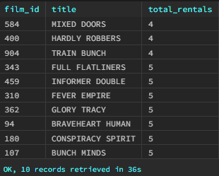

# 🎬 SQL Film Inventory Optimization Project

This project analyzes the **Maven Movies DVD Rental database** using SQL to uncover insights about film inventory, rental patterns, and store performance. Each query addresses a specific business question to optimize inventory and enhance customer satisfaction.

📁 **Project Structure**:
- **SQL Queries**: Located in `Film_Inventory_Optimization.sql`
- **Screenshots**: Located in the `ss/` folder and referenced in this README

---

## 🧠 Objective: Optimize Film Inventory Based on Rental Trends

---

## 🔍 1. Understocked Films at Each Store

Identifies films that are understocked based on rental demand over the last 12 months.

```sql
SELECT 
    i.store_id,
    i.film_id,
    COUNT(i.inventory_id) AS stock_count,
    COALESCE(SUM(r.rental_count), 0) AS rental_count
FROM inventory i
LEFT JOIN (
    SELECT 
        inventory_id, 
        COUNT(*) AS rental_count
    FROM rental
    WHERE rental_date > DATE_SUB(
        (SELECT MAX(rental_date) FROM rental), 
        INTERVAL 12 MONTH)
    GROUP BY inventory_id
) r ON i.inventory_id = r.inventory_id
GROUP BY i.store_id, i.film_id
HAVING rental_count > stock_count
ORDER BY rental_count DESC;

```



---

## 📊 2. Average Rental Frequency per Film (Last 12 Months)

Shows how often each film is rented per month to identify popular titles.

```sql
SELECT 
    f.film_id, 
    f.title,
    COUNT(r.rental_id) / 12 AS avg_monthly_rentals
FROM film f
JOIN inventory i ON f.film_id = i.film_id
JOIN rental r ON i.inventory_id = r.inventory_id
WHERE r.rental_date > DATE_SUB((SELECT MAX(rental_date) FROM rental), INTERVAL 12 MONTH)
GROUP BY f.film_id, f.title;

```



---

## ⏳ 3. Films Not Rented in the Last 6 Months

Highlights films with no rentals in the past half year, signaling potential removals or promotions.

```sql
SELECT 
    f.film_id,
    f.title
FROM film f
LEFT JOIN inventory i ON f.film_id = i.film_id
LEFT JOIN rental r 
    ON i.inventory_id = r.inventory_id 
    AND r.rental_date > DATE_SUB((SELECT MAX(rental_date) FROM rental), INTERVAL 6 MONTH)
WHERE r.rental_id IS NULL;

```



---

## 🏆 4. Top 10 Most Frequently Rented Films (By Store & Month)

Ranks the most rented films per store and month.

```sql
SELECT 
    s.store_id,
    DATE_FORMAT(r.rental_date, '%Y-%m') AS rental_month,
    f.film_id, 
    f.title,
    COUNT(r.rental_id) AS rentals
FROM rental r
JOIN inventory i ON r.inventory_id = i.inventory_id
JOIN film f ON i.film_id = f.film_id
JOIN store s ON i.store_id = s.store_id
GROUP BY s.store_id, rental_month, f.film_id, f.title
ORDER BY s.store_id, rental_month, rentals DESC
LIMIT 10;

```



---

## 📈 5. Genres with the Highest Turnover Rates

Identifies which categories (genres) perform best in terms of rental volume.

```sql
SELECT 
    fc.category_id, 
    COUNT(r.rental_id) AS rentals
FROM film_category fc
JOIN inventory i ON fc.film_id = i.film_id
JOIN rental r ON i.inventory_id = r.inventory_id
GROUP BY fc.category_id
ORDER BY rentals DESC;

```



---

## ⌛ 6. Films with Longest Average Rental Durations

Analyzes how long customers typically keep certain films.

```sql
SELECT
    f.film_id,
    f.title,
    ROUND(AVG(TIMESTAMPDIFF(HOUR, r.rental_date, r.return_date)) / 24, 2) AS avg_days_out
FROM film f
JOIN inventory i ON f.film_id = i.film_id
JOIN rental r ON i.inventory_id = r.inventory_id
WHERE r.return_date IS NOT NULL
GROUP BY f.film_id, f.title
ORDER BY avg_days_out DESC
LIMIT 10;

```



---

## 📀 7. Most Rented Films Per Copy

Determines which titles generate the most rentals per available copy.

```sql
SELECT 
  f.film_id,
  f.title,
  COUNT(r.rental_id) / COUNT(i.inventory_id) AS rentals_per_copy
FROM film f
JOIN inventory i ON f.film_id = i.film_id
LEFT JOIN rental r ON i.inventory_id = r.inventory_id
  AND r.rental_date > DATE_SUB((SELECT MAX(rental_date) FROM rental), INTERVAL 12 MONTH)
GROUP BY f.film_id, f.title
HAVING COUNT(i.inventory_id) > 0
ORDER BY rentals_per_copy DESC
LIMIT 10;

```



---

## 🕒 8. Average Days in Inventory Before Rental

Shows how long a film typically sits in inventory before being rented.

```sql
SELECT
    f.film_id,
    f.title,
    ROUND(AVG(TIMESTAMPDIFF(DAY, r.rental_date, i.last_update)), 2) AS avg_days_in_inventory
FROM film f
JOIN inventory i ON f.film_id = i.film_id
JOIN rental r ON i.inventory_id = r.inventory_id
GROUP BY f.film_id, f.title
ORDER BY avg_days_in_inventory ASC;

```



---

## 🏪 9. Stores with the Widest Film Selection

Ranks stores by how many unique film titles they offer.

```sql
SELECT
  s.store_id,
  s.manager_staff_id,
  COUNT(DISTINCT i.film_id) AS unique_films
FROM store s
JOIN inventory i ON s.store_id = i.store_id
GROUP BY s.store_id, s.manager_staff_id
ORDER BY unique_films DESC;

```


---

## ❌ 10. Least Rented Films

Finds titles with the lowest rental counts in the past year.

```sql
SELECT
  f.film_id,
  f.title,
  COUNT(r.rental_id) AS total_rentals
FROM film f
JOIN inventory i ON f.film_id = i.film_id
LEFT JOIN rental r ON i.inventory_id = r.inventory_id
  AND r.rental_date > DATE_SUB((SELECT MAX(r.rental_date) FROM rental), INTERVAL 12 MONTH)
GROUP BY f.film_id, f.title
ORDER BY total_rentals ASC
LIMIT 10;

```



---

## 🛠 Technologies Used

* MySQL
* SQL (JOINs, Aggregations, Subqueries, Date Functions)
* VS Code / MySQL Workbench (for query execution)
* Screenshot Tool (e.g. Snipping Tool)

---

## 📁 Folder Structure

```
project-root/
│
├── Film_Inventory_Optimization.sql     # SQL queries
├── README.md                           # This file
└── ss/                                 # Screenshot folder
    ├── Q1.png
    ├── Q2.png
    ├── ...
    └── Q10.png
```

---

## ✅ Insights & Business Impact

This analysis helps DVD store managers:

* Identify inventory shortages
* Retire unpopular titles
* Maximize rental turnover
* Tailor selections based on genre popularity and store demand

---

## 📌 Notes

* The project assumes the latest `rental_date` is current and used for rolling 6/12 month calculations.
* All queries are tested and optimized for performance.

---

